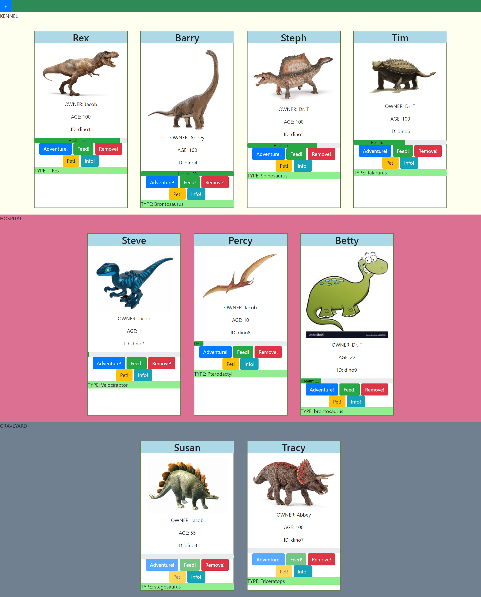

# dino-kennel

This challenge was our first milestone project at NSS. The project was designed to test the skills we had learned up to this point in the course and get a feel for where we stood. The requirements for the site are as follows:
- Healthy dinos show in the kennel
- Sick dinos show in the hospital
- Dead dinos show in the graveyard
- Dinos can be fed
- Dinos can be petted
- Dinos can be removed from the kennel
- Dinos can be sent on an adventure
- You can add your own dino.

## Screenshot

## Motivation

The Idea behind the project was to do this project alone, and get a feel for where you are in the learning journey. It also built upon all the different concepts we had learned up to this point. 

## Build Status

https://optimistic-golick-3749f3.netlify.app/

## Technology Used

- Javascript ES6
- Jquery 3.5

## Code Example

<addr>const feedButton = (id) => {
  $(`#feed${id}`).on("click", () => {
    let mydino = dinos.find((c) => c.id === id);
    mydino.health += 10;
    buildCards();
  });
}
const petButton = (id) => {
  $(`#pet${id}`).on("click", () => {
    let mydino = dinos.find((c) => c.id === id);
    mydino.health += 1;
    buildCards();
  });
}</addr>